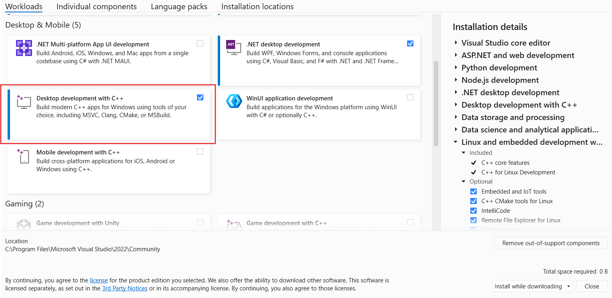
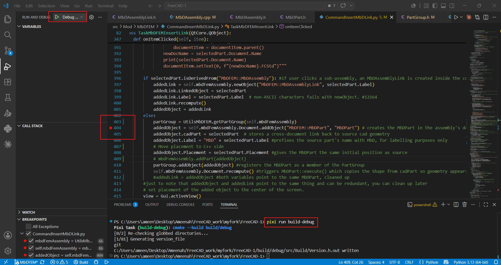
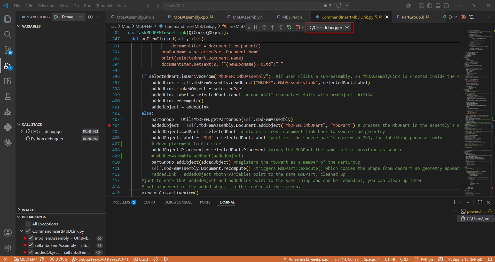

# Setting up VS Code for development and debugging on a Windows machine

## Install pixi
Installing pixi will help take care of all the dependencies. 
Inside the windows powershell, run the following: 

`iwr -useb https://pixi.sh/install.ps1 | iex`

For more information on pixi in FreeCAD, check this [page](https://freecad.github.io/DevelopersHandbook/gettingstarted/) in the official FreeCAD Developer's Handbook.

## Install Visual Studio
1. Download **Visual Studio 2026 Community Edition** from the [Visual Studio website](https://visualstudio.microsoft.com/).
2. Run the installer. When prompted to select workloads, check **Desktop development with C++**.

This is required even if Visual Studio is not used as the development IDE, in order for CMake to find the MSVC compiler (`cl.exe`). Pixi will handle CMake and all other dependencies automatically, so no separate CMake installation is needed.

##	Clone github repo
Fork the FreeCAD repository into your own github and then clone it into your local drive using the following command.

`git clone --recurse-submodules https://github.com/YourUsername/FreeCAD FreeCAD-src`

##	Copy .vscode file out of contrib and into FreeCAD root 
1. Open the repository in VS Code.
2. Inside `/contrib`, there is a folder called `.vscode`. Copy that file to the root directory of the repo.

In my experience, when I used the `.vscode` file in the original FreeCAD repo, I was only able to debug the C++ side of FreeCAD. It seems like the settings for debuggin in Python are for a Mac/Linux environment. So I added a few things to the files inside `.vscode` to debug in both C++ and Python on a Windows environment. The files can be found [here](https://github.com/Ay-mi/FreeCAD_extrafiles).

##	Start debugging in VS Code
1. Navigate to your FreeCAD source directory: 
   `cd path\to\FreeCAD-src`
2. Run configure (only needed once): 
   `pixi run configure`

3. Install `debugpy` for Python debugging. In the cmd, run: 

   `pip install debugpy`
   
   This installs debugpy into the system. 
   
   If Python debugging does not work, try installing it directly into the pixi environment instead: 

   `path\to\FreeCAD-src\.pixi\envs\default\python.exe -m pip install debugpy`

Step 2 and 3 only need to be done once for a new clone. If debugpy was installed in the system and not in the pixi environment, it does not need to be installed again after this even for new clones.

4. Build in debug mode: 
   `pixi run build-debug`

To build in release mode use `pixi run build`. 

In case the VS Code terminal shows errors, try to run the Pixi commands in the **Developer Command Prompt** as CMake requires the MSVC environment variables to be initialized first. To do this, open **"Developer Command Prompt"** and initialize the MSVC environment by running: 
   `"C:\Program Files\Microsoft Visual Studio\18\Community\VC\Auxiliary\Build\vcvarsall.bat" x64` 
Then run the pixi commands. 

For more information, take a look at this [page](https://freecad.github.io/DevelopersHandbook/gettingstarted/VSCode) in the Developer's Handbook.

##	Set breakpoints
- Before running debug mode, make sure to run `pixi run build-debug` at least once since VS Code was opened.
- Set breakpoints and then click the green play button to debug.
- Use the drop-down to switch between the Python and C++ debuggers.

